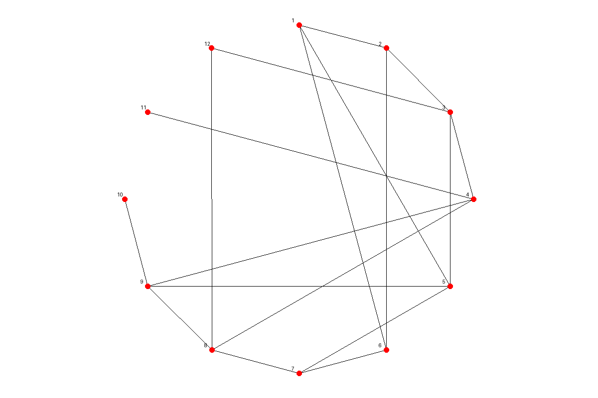

### Rozwiązanie pierwszego projektu ###

## Spis treści  
- [Opis](#opis)  
- [Wymagania](#wymagania)  
- [Instalacja](#instalacja)  
- [Autorzy](#autorzy)  

## Opis  
Temat projektu dawał wolność implementacji. Należało zaimplementować konwersje pomiędzy 3 reprezentacjami grafu (macierzą sąsiedztwa, listą sąsiedztwa i macierzą incydencji). Funkcje zaimplementowane są w Pythonie przy pomocy klas reprezentujących daną reprezentację :). 

Mieliśmy zaimplementować też generowanie obrazka reprezentującego graf - jego wierzchołków i krawędzi oparty na kole. Zrealizowane przy pomocy funkcji w pliku GraphVisual.py, która przyjmuje jako argument dowolną reprezentację grafu. Poniżej otrzymana reprezentacja.

Ostatnie zadanie to wygenerowanie dowolnego grafu o danej liczbie wierzchołków. Mieliśmy to zrobić dla podanej liczby krawędzi oraz dla prawdopodobieństwa tego, że krawędź wystąpi w grafie.

Szczegóły implementacji są udokumentowane w kodzie.

## Wymagania  
- python3
- moduł PIL

## Instalacja  
git clone git@github.com:mroki58/GraphLab.git
cd GraphLab
cd lab1
pip install PIL // jeśli nie zainstalowany // domyślnie znajduję się w ubuntu na pewno od wersji 24.04 LTS
python3 graphs1.test.py // aby sprawdzić czy wszystko działa

## Autorzy
