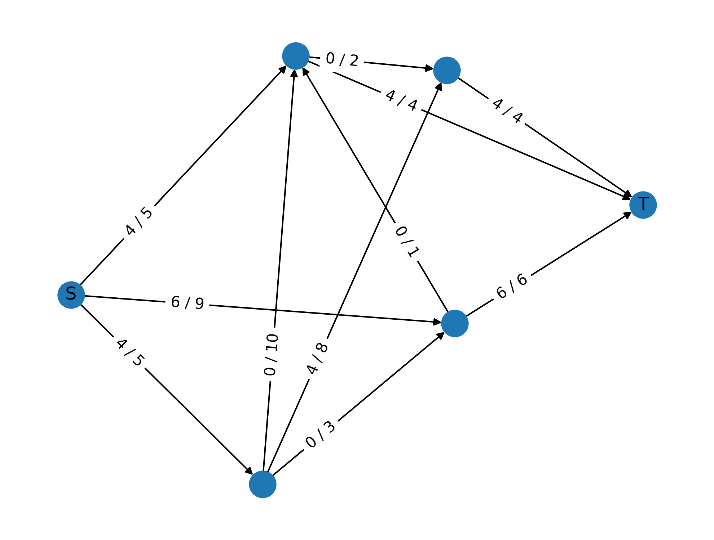

# Projekt: Sieć warstwowa i maksymalny przepływ — implementacja algorytmu Forda-Fulkersona

---

## Opis projektu

Celem projektu jest:

- Wygenerowanie losowej sieci przepływowej o strukturze warstwowej z pojedynczym źródłem i ujściem,
- Znalezienie maksymalnego przepływu w tej sieci za pomocą algorytmu Forda-Fulkersona,
- Wizualizacja grafu z oznaczeniem przepływów i przepustowości krawędzi.

Sieć warstwowa jest modelowana jako graf skierowany, w którym wierzchołki są ułożone w warstwy od źródła (warstwa 0) do ujścia (warstwa N+1). Krawędzie między warstwami prowadzą wyłącznie od warstwy i do warstwy i+1, a następnie dodawane są losowe krawędzie dodatkowe.

---

## 1. Generacja grafu warstwowego — pseudokod

```text
FUNKCJA createNetwork(N):
    # N — liczba warstw pośrednich (N ≥ 2)
    
    Stwórz pusty graf skierowany G
    
    Dodaj wierzchołek źródłowy S na warstwie 0
    Dodaj wierzchołek ujścia T na warstwie N+1
    
    previousLayer ← [S]
    nodeId ← 2
    
    DLA i od 1 do N:
        vertexInLayer ← losowa liczba z zakresu [2, N]
        currentLayer ← pusta lista
        
        DLA j od 1 do vertexInLayer:
            Dodaj wierzchołek nodeId do warstwy i
            currentLayer.dodaj(nodeId)
            nodeId ← nodeId + 1
        
        # Łączymy wszystkie wierzchołki warstwy poprzedniej z warstwą bieżącą
        WHILE istnieje wierzchołek w previousLayer bez krawędzi wychodzącej do currentLayer
              lub wierzchołek w currentLayer bez krawędzi wchodzącej z previousLayer:
            Wybierz losowy wierzchołek v z previousLayer
            Wybierz losowy wierzchołek u z currentLayer
            Jeżeli nie istnieje krawędź v → u, dodaj ją do G
        
        previousLayer ← currentLayer
    
    # Łączymy ostatnią warstwę z ujściem
    Dodaj krawędzie między wierzchołkami z previousLayer a T podobnie jak wyżej
    
    # Dodaj 2 * N losowych krawędzi między dowolnymi wierzchołkami z wyjątkiem
    # krawędzi wchodzących do S i wychodzących z T, bez duplikatów.
    DLA i od 1 do 2*N:
        losuj v, u wierzchołki w G
        jeżeli v != u, v != T, u != S, krawędź v → u nie istnieje, dodaj krawędź
    
    Zwróć graf G
```
---
## 2. Algorytm Forda-Fulkersona z BFS — pseudokod

```text
FUNKCJA FordFulkerson(G, S, T):
Utwórz graf rezydualny Gf jako kopię G
Dla każdej krawędzi (u,v) w G ustaw przepływ f(u,v) = 0
WHILE istnieje ścieżka powiększająca P od S do T w Gf (znajdowana BFS):
    cf ← minimalna przepustowość na ścieżce P w Gf
    
    DLA każdej krawędzi (u,v) na ścieżce P:
        f(u,v) ← f(u,v) + cf  # jeśli krawędź istnieje w G
        f(v,u) ← f(v,u) - cf  # jeśli krawędź jest rezydualna (w przeciwnym kierunku)
        Zaktualizuj przepustowości w Gf:
            zmniejsz c(u,v) o cf
            zwiększ c(v,u) o cf (dodaj krawędź rezydualną jeśli nie istnieje)

Oblicz maksymalny przepływ jako sumę przepływów wychodzących ze źródła S
Zwróć tę wartość
```

---

## 3. Wizualizacja grafu

- Wierzchołki są układane według warstw (kolumny),
- Pozycje wierzchołków są lekko losowo przesunięte (szum ±0.2), aby zminimalizować nakładanie krawędzi,
- Na krawędziach wyświetlane są etykiety w formacie: przepływ/przepustowość


